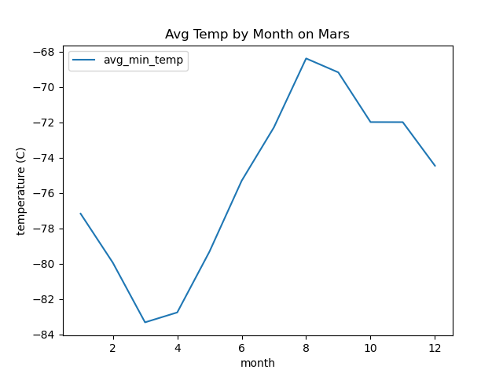
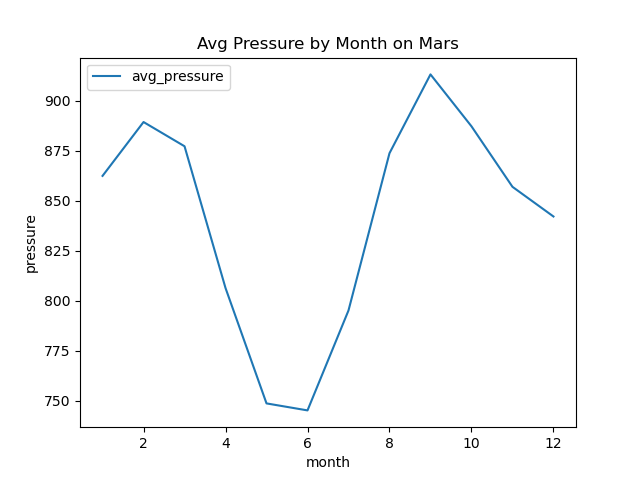

# web-scraping-challenge

## Deliverable 1: Scrape Titles and Preview Text from Mars News
part_1_mars_news.ipynb

 [Mars news site](https://static.bc-edx.com/data/web/mars_news/index.html)

## Deliverable 2: Scrape and Analyze Mars Weather Data
part_2_mars_weather.ipynb

[Mars Temperature Data Site](https://static.bc-edx.com/data/web/mars_facts/temperature.html)

### 1. How many months are there on Mars?
12

### 2. How many Martian days' worth of data are there?
1977

### 3. What is the average low temperature by month?

Coldest month is 3 and hottest month is 8.

### 4. Average pressure by Martian month

### 5. How many terrestrial (earth) days are there in a Martian year?
A year on Mars appears to be about 670 days. Internet search confirms that a Mars year is equivalent to 687 earth days.

### Dataframe Output
Output/mars_data.csv

